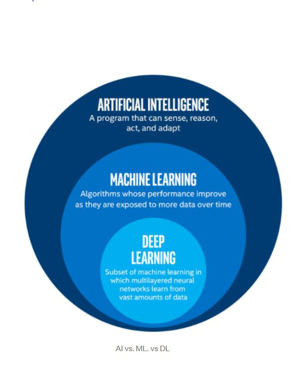
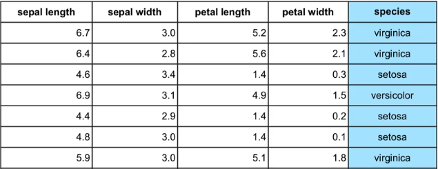
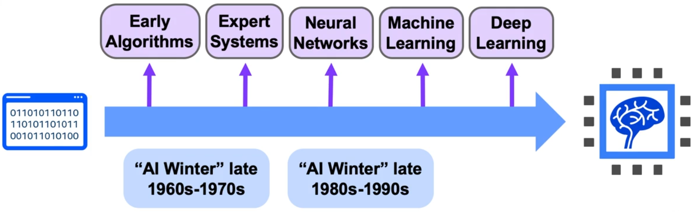

# Machine Learning Course - Comprehensive Student Notes

## Chapter 1: Introduction to Artificial Intelligence and Machine Learning

### 1.1 Core Definitions and Hierarchy

#### Artificial Intelligence (AI)
**Definition:** Any program that can sense, reason, act, and adapt
- Branch of computer science dealing with simulation of intelligent behavior in computers
- When machines mimic cognitive functions humans associate with human minds (learning, problem-solving)
- **Key Point:** AI is the broadest category - any machine exhibiting intelligent behavior
- **Example of AI (not ML):** Rule-based systems that don't learn from data

#### Machine Learning (ML)
**Definition:** Study and construction of programs that are NOT explicitly programmed, but learn patterns as they're exposed to more data over time
- Subset of Artificial Intelligence
- Programs learn from repeatedly seeing data rather than being explicitly programmed by humans
- **Key Insight:** Performance improves with more data (though eventually plateaus with diminishing returns)
- **Critical Difference:** Not a set of rules programmed by humans - the machine learns the rules itself

#### Deep Learning (DL)
**Definition:** Machine Learning involving very complicated models called deep neural networks
- Subset of Machine Learning
- Uses multi-layered neural networks
- Models determine best representation of original data automatically
- **Breakthrough Capability:** Can learn features on its own (unlike classic ML where humans define features)

**Hierarchy Summary:** 

### 1.2 Historical Context - Major Breakthroughs

#### Image Classification Achievement (2015)
- Computers surpassed human performance in classifying images into categories
- Example Task: Distinguishing dogs from cats in photos
- **Why Hard for Classical ML:** Difficult to identify useful features manually

#### Machine Translation Progress
- Goal: Translate phrases between languages while maintaining proper word order and phrasing
- Example: "I am a student" → "Je suis étudiant" (French)
- **Why Hard for Classical ML:** Translation isn't word-by-word; requires understanding context, grammar, idioms

**Key Enablers:** Advancements in deep learning + innovations in data storage + increased processing power

---

## Chapter 2: Machine Learning Fundamentals

### 2.1 How Machine Learning Works

#### Email Spam Detection Example (Process Walkthrough)
1. **Start:** Dataset with emails labeled as "spam" or "not spam"
2. **Preprocessing:** Emails are preprocessed and prepared for algorithm
3. **Training:** ML algorithm learns patterns distinguishing spam from legitimate email
4. **Learning Principle:** More emails = better pattern recognition
5. **Production:** Once trained, model predicts spam/not-spam for new incoming emails

### 2.2 Key Terminology and Concepts

#### Iris Dataset Example (Understanding Data Structure)
**Dataset:** Classic iris flower dataset with 3 species (virginica, setosa, versicolor)

**Features (Explanatory Variables):**
- Sepal length
- Sepal width  
- Petal length
- Petal width
- **Definition:** Columns used to make predictions (all columns except target)
- **Purpose:** Input data the model uses to learn patterns

**Target Variable:**
- Species (what we're trying to predict)
- **Definition:** The column/value we want to predict
- Also called the "label" when referring to a specific value

**Example/Observation:**
- **Definition:** A single row in the dataset
- Contains all feature values + target value for one data point

**Label:**
- **Definition:** The actual value of the target variable for a single example
- Example: "versicolor" is a label in the species column

### 2.3 Types of Machine Learning

#### Supervised Learning
**Requirements:** Dataset with target column/labels  
**Goal:** Predict the label/target value  
**Key Questions:** "Is it spam or not spam?" "Which flower species is this?"

**Fraud Detection Example:**
- **Features:** Transaction time, amount, location, purchase category
- **Target:** Fraud vs. Not Fraud
- **Process:** Learn patterns from labeled historical transactions → predict fraud in new transactions
- **Learning:** Model identifies unusual patterns that indicate fraudulent activity

#### Unsupervised Learning
**Requirements:** Dataset WITHOUT target column  
**Goal:** Find underlying structure/patterns in data  
**Key Point:** No "right" or "wrong" answer - must evaluate results for usefulness

**Customer Segmentation Example:**
- **Use Case:** E-commerce data for marketing campaigns
- **Process:** Algorithm finds natural groupings in customer data
- **Result:** Customer groups to target with specific marketing strategies
- **Challenge:** Must test different models to see which segmentation makes most business sense

### 2.4 Traditional ML vs. Deep Learning Challenges

#### Structured Data with Intuitive Features (Good for Traditional ML)
**Credit Card Fraud Example:**
- Clear, defined features: time, amount, location, category
- Relatively straightforward patterns to detect
- Traditional ML algorithms work well

#### Image Classification Challenge (Where Deep Learning Excels)
**Cat vs. Dog Classification Problem:**

**Traditional ML Limitations:**
1. **Feature Definition Problem:**
   - Images = numerical data representing pixel colors
   - Small 256×256 image = 65,000+ pixels = 65,000+ features
   - Overwhelming number of features for traditional algorithms

2. **Spatial Relationship Loss:**
   - Individual pixels lose meaning without surrounding context
   - Pixels making up only meaningful together
   - Pixels' positions relative to face structure matter

**Deep Learning Solution:**
- Automatically learns meaningful features
- Combines pixels to capture spatial relationships
- No manual feature engineering required

### 2.5 Deep Learning

#### How Deep Learning Works Differently

**Classical Machine Learning Approach (2 Steps):**
1. **Human defines features:** Manually identify what makes up nose, eyes, etc.
2. **Algorithm learns from features:** Use these predefined features to classify

**Problems with Classical Approach:**
- Data scientist must guess good features (extremely challenging)
- May miss important patterns humans don't recognize
- Time-consuming and requires domain expertise

**Deep Learning Approach (Combined Process):**
1. **Input:** Raw pixels fed directly to neural network
2. **Automatic Feature Learning:** Network learns meaningful features by combining pixels in complex ways
3. **Progressive Complexity:** 
   - First layers: Detect edges
   - Middle layers: Combine edges into shapes (nose, eyes, lips)
   - Final layers: Complete face recognition
4. **Output:** Final classification

**Key Insight:** Intermediate features may not be human-interpretable but are highly effective for the task

#### When to Use Deep Learning vs. Traditional ML

**Deep Learning Advantages:**
- Large datasets available
- Complex patterns (images, text, audio)
- Steady, consistent data over time
- Cutting-edge performance needed

**Traditional ML Advantages:**
- Smaller datasets
- Data changes frequently over time
- Need interpretable results
- Structured data with clear features
- **Important:** Often performs BETTER than deep learning on smaller and simpler datasets

---

## Chapter 3: History of Artificial Intelligence

### 3.1 Timeline of Major Events

#### The Beginning (1950s)
**1950 - Turing Test:**
- Alan Turing develops test for machine intelligence
- Question: Can a computer imitate a human well enough that a judge can't tell the difference?
- Foundational threshold for AI

**1956 - Dartmouth Conference:**
- Term "Artificial Intelligence" officially coined
- Researchers agree AI is achievable
- Field officially established

**1957 - Perceptron Algorithm:**
- Frank Rosenblatt invents precursor to modern neural networks
- Shows machines can learn from data
- Generates huge excitement

**1959 - Machine Learning Term:**
- Arthur Samuel creates checkers program
- Learns from board positions seen in past
- Popularizes term "machine learning"

### 3.2 First AI Winter (1960s-1970s)

**Causes of Decline:**

**1966 - Machine Translation Failure:**
- US government committee assesses Russian-English translation progress
- Verdict: Very little return on investment
- Major blow to AI hype

**1969 - Perceptron Limitations:**
- Marvin Minsky identifies major limitations
- Shows perceptrons can't solve certain problems
- Another blow to AI credibility

**1973 - Lighthill Report:**
- British mathematician publishes damning report
- AI discoveries fall well short of promises
- Governments cut funding dramatically

**Result:** First AI Winter - massive funding cuts and decreased interest

### 3.3 Second Boom (1980s)

**Expert Systems Era:**
- Rule-based systems mimicking human experts
- Hard-coded facts and rules
- Run on expensive mainframe computers ($200,000/month)
- Used specialized languages like LISP
- **Success:** AI infiltrates business world at scale

**1980s - Backpropagation Algorithm:**
- Geoffrey Hinton and others publish breakthrough
- Possibly most important algorithm for deep learning
- Allows multi-layer networks to learn from data
- Creates excitement about learning complex patterns

### 3.4 Second AI Winter (Late 1980s-1990s)

**Why Expert Systems Failed:**
- Couldn't learn from new data
- Finicky - terrible mistakes with abnormal inputs
- Capabilities moved to cheaper PCs
- Investment in mainframes subsided

**Why Neural Networks Failed:**
- Didn't scale to large problems
- Backpropagation faced implementation problems
- Issues with large datasets and networks
- Theoretical promise didn't match practical results

### 3.5 The Resurgence (1990s-2000s)

**Machine Learning Successes:**
- Speech recognition
- Medical diagnosis
- Robotics
- Integration into larger systems

**Notable Achievements:**
- **1996:** Deep Blue defeats world chess champion
- **Late 1990s:** Google revolutionizes search with PageRank algorithm
- **2006:** Geoffrey Hinton overcomes deep learning limitations (exploding/vanishing gradients)
- Neural networks rebranded as "deep learning"

### 3.6 The Deep Learning Revolution (2010s)

**2009 - ImageNet Database:**
- Millions of labeled images available
- Unprecedented training data for vision models

**2012 - The Climax (AlexNet):**
- Convolutional neural network achieves 15.3% error rate
- Beats nearest competitor by 10.8 percentage points
- **Watershed moment** - proves deep learning superiority

**Subsequent Breakthroughs:**
- **2013:** Word embeddings - understanding conceptual meaning
- **2014:** Machine translation breakthrough (solving 1960s goal)
- **2014:** Photo captioning - "baseball player throwing ball"
- **2015:** TensorFlow released
- **2016:** AlphaGo defeats Go master
- **2018:** Waymo launches self-driving taxi service
- **2019:** IBM Project Debater debates human champion

---

## Chapter 4: AI Today and Applications

### 4.1 Why This Era is Different

**Three Key Factors:**

1. **Bigger Datasets:**
   - ImageNet opened floodgates
   - Cloud infrastructure for cheap storage
   - New data capture methods
   - Diverse data across all fields

2. **Faster Computers:**
   - 1980s mainframe: $200,000/month
   - Today: More powerful laptops
   - GPUs accelerate neural network training
   - Cloud computing on demand

3. **Constant Innovation:**
   - New neural network architectures
   - Open source libraries
   - Industry investment
   - Academic research explosion

### 4.2 AI in Industries

#### Healthcare
- **Medical Imaging:** AI diagnoses with almost the same accuracy as a doctor
- **Drug Discovery:** Pfizer uses IBM Watson for immuno-oncology drugs
- **Patient Care:** Sensory aids for deaf, blind, amputees
- **Example Impact:** X-ray and MRI analysis approaching/exceeding expert performance

#### Finance
- Algorithmic trading
- Fraud detection (real-time transaction analysis)
- Personal finance management
- Risk mitigation
- Research automation

#### Transportation
- Autonomous cars
- Automated trucking
- Aerospace optimization (simulations, maintenance)
- Optimal shipping routes and timing
- Search and rescue drones

#### Industrial/Energy
- Factory automation
- Predictive maintenance
- Agricultural optimization
- Smart grids for efficient energy distribution
- Oil and gas exploration

#### Government
- Defense and threat identification
- Weather and pandemic insights
- Smart city optimization (traffic, healthcare, emergency services)
- Citizen engagement enhancement

### 4.3 AI in Daily Life

#### Personal Transportation
- **Route Optimization:** Google Maps/Waze incorporate traffic, weather, historical data
- **Dynamic Pricing:** Uber/Lyft adjust prices based on real-time supply/demand

#### Social Media
- Content recommendations
- Friend/group suggestions
- Targeted advertisements
- Image recognition (face tagging)
- Sentiment analysis for content moderation

#### Voice Assistants
- Siri, Alexa recognize voice
- Answer questions
- Perform tasks
- Natural language processing in action

#### Computer Vision Applications
- Face unlock on phones
- Photo organization
- Self-driving car object detection
- Abandoned baggage detection (security)

---

## Chapter 5: Machine Learning Workflow and Tools

### 5.1 Complete ML Workflow

#### Step 1: Problem Statement
- **Key Question:** What problem are you trying to solve?
- **Example:** Classify different dog breeds in images
- Must be specific and measurable

#### Step 2: Data Collection
- **Key Question:** What data do you need?
- **Example Requirements:**
  - Multiple pictures per dog breed
  - Different lighting conditions
  - Various angles
  - Correct labels for all images

#### Step 3: Data Exploration and Preprocessing
- **Key Question:** How to clean data for model use?
- **Activities:**
  - Check distribution of classes
  - Create heatmaps of pixel density
  - Convert pixels to multidimensional arrays
  - Scale color values appropriately
  - Handle missing or corrupted data

#### Step 4: Modeling
- Build model to solve problem
- Start with baseline model
- Iterate with difference approaches
- Compare performance

#### Step 5: Validation
- **Key Question:** Did we solve the problem?
- Use holdout set (data not used in training)
- Measure accuracy on unseen data
- Ensure model generalizes well

#### Step 6: Decision-Making and Deployment
- Communicate results to stakeholders
- Move to production if performance acceptable
- Monitor performance in real-world use
- Plan for model updates

### 5.2 Essential Tools and Libraries

#### Python Libraries for ML

**NumPy**
- Numerical analysis
- Array operations
- Mathematical functions

**Pandas**
- Data manipulation
- DataFrames for structured data
- Data cleaning and preparation

**Matplotlib & Seaborn**
- Data visualization
- Statistical plots
- Model performance visualization

**Scikit-Learn**
- Traditional machine learning algorithms
- Model evaluation tools
- Data preprocessing utilities

**TensorFlow & Keras**
- Deep learning frameworks
- Neural network construction
- Model training and deployment

---

## Key Takeaways

1. **AI Hierarchy:** Deep Learning ⊂ Machine Learning ⊂ Artificial Intelligence

2. **ML Success Factors:** 
   - Quality and quantity of data
   - Appropriate algorithm selection
   - Proper validation

3. **When to Use What:**
   - Traditional ML: Smaller datasets, interpretable results needed
   - Deep Learning: Large datasets, complex patterns (images, text)

4. **Historical Lessons:**
   - AI has cycled through winters and booms
   - Current era different due to data, compute, and algorithms
   - Practical applications now widespread

5. **Practical Workflow:**
   - Always start with clear problem definition
   - Data quality matters more than algorithm complexity
   - Validation on unseen data is crucial
   - Consider deployment from the beginning