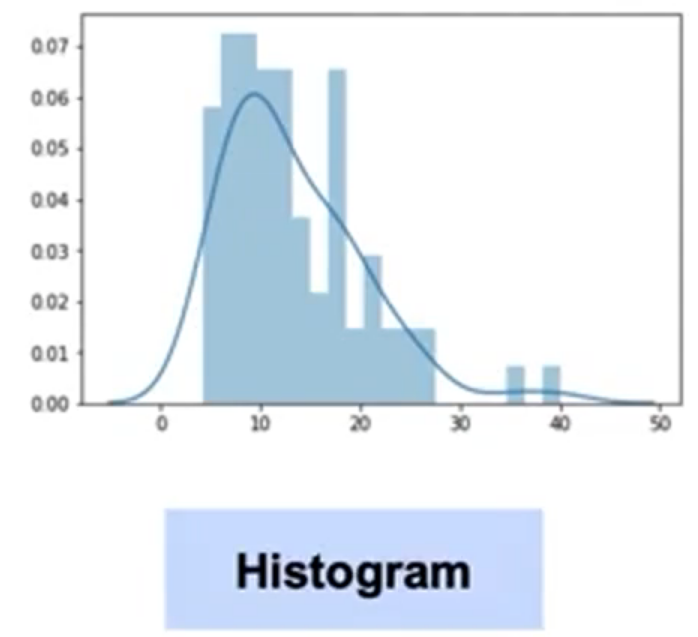
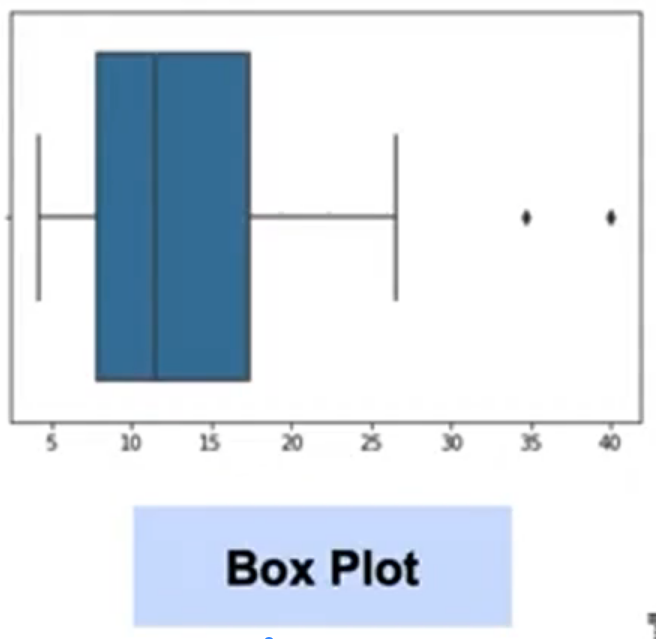

# Machine Learning Data Fundamentals - Complete Study Notes

## Part 1: Data Retrieval from Multiple Sources

## 1.1 CSV Files (Comma Separated Values)

### Definition
CSV files consist of rows of data where values are separated by commas. This is one of the most common formats for storing tabular data.

### Basic Implementation in Pandas

#### Standard CSV Reading Example:
```python
# Step 1: Import pandas (standard practice to alias as 'pd')
import pandas as pd

# Step 2: Define the file path
file_path = 'data/iris_data.csv'

# Step 3: Read CSV into DataFrame
data = pd.read_csv(file_path)

# Step 4: View first 5 rows
print(data.iloc[:5])
```

**Output Structure:** DataFrame with columns like sepal_length, sepal_width, petal_length, petal_width, species

### Important Arguments for read_csv()

#### 1. **Separator Specification**
```python
# For tab-separated files (TSV)
data = pd.read_csv(file_path, sep='\t')

# For space-separated with varying spaces
data = pd.read_csv(file_path, delim_whitespace=True)
```
**Note:** Different delimiters require different arguments. Use `\t` for tabs in Python.

#### 2. **Header Management**
```python
# Skip rows or specify which row contains headers
data = pd.read_csv(file_path, header=2)  # Use row 2 as header

# Provide custom column names
column_names = ['col1', 'col2', 'col3']
data = pd.read_csv(file_path, names=column_names)
```
**Note:** Column names list must match the exact number of columns in the DataFrame.

#### 3. **Null Value Handling**
```python
# Define which values should be treated as null
data = pd.read_csv(file_path, na_values=['NA', '99', 'missing'])
```
**Note:** Common error values or placeholder values (like 99 for missing data) can be automatically converted to null during import.

---

## 1.2 JSON Files (JavaScript Object Notation)

### Definition
Standard format for storing data across platforms, especially common in:
- NoSQL databases
- API responses
- Cross-platform data exchange

### Structure Characteristics
- Similar to Python dictionaries
- Key-value pairs
- Organized and easily accessible format

#### Example JSON Structure:
```python
# JSON representation of one row of data
{
    "column_name1": "value1",
    "column_name2": "value2",
    "column_name3": "value3"
}
```

### Reading JSON Files
```python
import pandas as pd

# Basic JSON reading
data = pd.read_json('data/file.json')

# If having issues, check the 'orient' argument
# Options: 'split', 'records', 'index', 'columns', 'values'
data = pd.read_json('data/file.json', orient='records')
```

**Note:** The `orient` parameter is crucial when JSON structure doesn't match expected format. Always consult documentation if reading fails.
The `orient` parameter defines the **orientation** of the JSON data when converting it into a DataFrame.
Some common options are:

* **`records`** (most commonly used):
  JSON is a list of dictionaries.

  ```json
  [{"col1":1,"col2":2},{"col1":3,"col2":4}]
  ```

  → DataFrame: each dictionary = 1 row.

* **`index`**:
  JSON is a nested dictionary where keys represent the index.

  ```json
  {"row1":{"col1":1,"col2":2}, "row2":{"col1":3,"col2":4}}
  ```

* **`columns`**:
  JSON is a dictionary where keys are column names and values are dictionaries of index-value pairs.

  ```json
  {"col1":{"row1":1,"row2":3}, "col2":{"row1":2,"row2":4}}
  ```

* **`split`**:
  JSON stores index, columns, and data separately.

  ```json
  {"index":["row1","row2"],"columns":["col1","col2"],"data":[[1,2],[3,4]]}
  ```

* **`values`**:
  JSON only contains lists of values (no column names).

  ```json
  [[1,2],[3,4]]
  ```


### Writing JSON Files
```python
# Convert DataFrame to JSON
data.to_json('output_file.json')
```

---

## 1.3 SQL Databases (Structured Query Language)

### Definition
Highly structured relational databases with fixed schema. Data is organized in tables with defined relationships.

SQL Database = Relational database uses SQL (Structured Query Language) to query and manage data.

Characteristics:

Highly structured: data is organized very tightly.

Fixed schema: tables, columns, predefined data types.

Organized in tables: data is stored in tables, rows and columns.

Defined relationships: tables can be linked together by primary keys/foreign keys.

### Common SQL Database Types
- Microsoft SQL Server
- PostgreSQL
- MySQL
- AWS Redshift
- Oracle DB
- IBM Db2 family

### Python Libraries for SQL Connection
- **sqlite3**: For SQLite databases
- **SQLAlchemy**: Works with multiple SQL database types
- **psycopg2**: Specifically for PostgreSQL
- **ibm_db**: For IBM Db2 family

### Complete SQL Connection Example (SQLite)

```python
# Step 1: Import required libraries
import sqlite3 as sq3
import pandas as pd

# Step 2: Define database path
path = 'data/classic_rock.db'

# Step 3: Establish connection
con = sq3.connect(path)

# Step 4: Write SQL query as string
query = "SELECT * FROM rock_songs"

# Step 5: Execute query and create DataFrame
data = pd.read_sql(query, con)

# Step 6: Don't forget to close connection when done
con.close()
```

**Note:**
1. Connection object (`con`) maintains the link to database
2. SQL queries are written as strings in Python
3. `pd.read_sql()` automatically converts query results to DataFrame
4. Always close connections to prevent resource leaks

---

## 1.4 NoSQL Databases

### Definition
Non-relational databases with flexible structure. Performance and overhead advantages over SQL in certain applications.

### NoSQL Database Types

#### 1. **Document Databases**
- Each document = one observation
- Stored as JSON-like documents
- Example: Each dictionary represents one record

#### 2. **Key-Value Stores**
- Primary key (like ID) maps to values
- Example: Person ID → {name, age, address}

#### 3. **Graph Databases**
- Optimized for relationship management
- Example: LinkedIn connections (1st, 2nd, 3rd level)

#### 4. **Wide Column Families**
- Columns grouped into families
- Example: 
  - Personal details family: name, location, age
  - Professional details family: experience, skills, visa status

### MongoDB Example (Popular NoSQL Database)

```python
# Step 1: Import and establish connection
from pymongo import MongoClient

# Create connection (may need username/password for cloud)
con = MongoClient()  # Can pass path/credentials as argument

# Step 2: List available databases
print(con.list_database_names())

# Step 3: Select specific database
db = con.database_name

# Step 4: Query data from collection (similar to SQL table)
cursor = db.collection_name.find({})  # {} selects all documents

# Step 5: Convert to Pandas DataFrame
# Cursor is generator object with JSON documents
df = pd.DataFrame(list(cursor))
```

**Note:**
1. NoSQL queries use dictionary/JSON syntax, not SQL strings
2. `{}` in MongoDB means "select all" (like SELECT * in SQL)
3. Results come as generator objects (cursor) that must be converted to lists
4. List of Python dictionaries can be directly converted to DataFrame

---

## 1.5 APIs and Cloud Data Access

### Use Cases
- Social media data (Twitter tweets)
- Marketing data (Amazon)
- Public datasets (UC Irvine Machine Learning Library)

### Direct URL Data Access Example

```python
import pandas as pd

# Define URL to data source
data_url = "https://archive.ics.uci.edu/ml/datasets/dataset.csv"

# Read directly from URL (same as local file)
df = pd.read_csv(data_url)
```

**Note:** `pd.read_csv()` can read directly from URLs, treating them like local files. This is equivalent to clicking "Download" on a CSV link.

---

## Part 2: Data Cleaning

### Why Data Cleaning is Critical

#### The "Garbage In, Garbage Out" Principle
Models can only be as good as the data they're trained on. Poor data quality leads to unreliable outcomes.

### Critical Components Affected by Dirty Data

1. **Observations (Rows)**
   - Unclean rows misrepresent feature-target relationships
   - Example: Duplicate fraud transactions give undue weight to specific patterns

2. **Labels (Target Variables)**
   - Incorrect labels mislead the model
   - Example: ImageNet with mislabeled pictures teaches wrong associations

3. **Algorithms**
   - Assume data accurately represents real world
   - Learn incorrect patterns from bad data

4. **Features (Columns)**
   - Incorrect values throw off predictions
   - Example: Wrong transaction amounts in fraud detection

5. **Models**
   - Built on assumption of real-world representation
   - Bad data leads to models that don't generalize

---

## 2.1 Common Data Quality Problems

### Problem Categories

#### 1. **Lack of Data**
- Insufficient relevant data for training
- Solutions:
  - Collect more appropriate data
  - Acquire from third parties
  - Ensure organization-wide accessibility

#### 2. **Too Much Data**
- Data spread across different environments
- Becomes data engineering problem
- Need to organize and consolidate

#### 3. **Bad Data Types**

##### A. **Duplicate Data**
- Adds unnecessary weight to observations
- Introduces noise
- Example: Credit card fraud transaction repeated 200 times overweights those specific features

##### B. **Inconsistent Text and Typos**
- Extra spaces
- Capitalization differences
- Same value treated as different categories
- Example: "New York", "new york", "NEW YORK" treated as three different values

##### C. **Missing Data**
- Too much missing data can make features unusable
- May eliminate powerful predictors

##### D. **Outliers**
- Skew features disproportionately
- Make true patterns hard to find
- Example: Sales typically 10-50, one week shows 3,000

##### E. **Data Sourcing Issues**
- Multiple systems with different formats
- On-premises vs cloud data
- Mismatches when combining sources

---

## 2.2 Handling Duplicate Data

### Analysis Approach
1. Determine if duplicates are legitimate
2. Consider context of duplication

### Example Scenarios

#### Legitimate Duplicates (Keep):
- Iris dataset: Two flowers with identical measurements
- Real-world occurrence with measurement precision limits

#### Unnecessary Duplicates (Remove):
- Exact same image in image labeling dataset
- Provides no additional information

### Best Practices
1. Always examine features before filtering
2. Keep access to original data
3. Don't over-filter - might lose important information

---

## 2.3 Handling Missing Data

**Core Problem:** Models cannot accept blank values as they contain no information

### Strategy 1: Remove Data

#### Implementation Options:
- Remove entire rows with missing values
- Remove entire columns with many missing values

#### Pros:
- Quick dataset cleaning
- No guessing replacement values
- Simple implementation

#### Cons:
- May lose too much information if many rows affected
- Can bias dataset if missingness has pattern
- Might remove important observations

### Strategy 2: Impute Data

#### Methods:
```python
# Replace with mean
df['column'].fillna(df['column'].mean(), inplace=True)

# Replace with median
df['column'].fillna(df['column'].median(), inplace=True)
```

#### Pros:
- Retain all rows and columns
- Preserve dataset size
- Keep potentially important information

#### Cons:
- Adds uncertainty to model
- Based on estimates, not real values
- May introduce bias

### Strategy 3: Mask Data

Create missing values as their own category.

#### When Useful:
- Missingness itself is informative
- Example: Phone survey where last question repeatedly blank → person hung up

#### Pros:
- No loss of rows/columns
- Captures pattern in missingness

#### Cons:
- Assumes all missing values have same meaning
- Adds complexity to model

**Decision Framework:** Choose based on:
- Amount of missing data
- Pattern of missingness  
- Importance of affected features
- Domain knowledge

---

## 2.4 Outlier Detection and Treatment

### Definition
Observations distinct from most other data points. Often aberrations that don't represent the phenomenon being modeled.

### Impact Example
- Normal sales: 10-50 range, average ~30
- Outlier week: 3,000 in sales
- Effect on mean: Pushes average to 200-300
- Result: Predictions far from actual expected values

**Important:** Some outliers are informative! The 3,000 sales week might reveal crucial information about what drives exceptional performance.

### Detection Methods

#### 1. **Visual Methods**

##### Histogram and Density Plot:
```python
import seaborn as sns

# Create histogram
sns.distplot(data, bins=30)
```




##### Box Plot:
```python
# Create box plot showing quartiles and outliers
sns.boxplot(data)
```



#### 2. **Mathematical Detection**

##### Box Plot Outlier Calculation:
```python
import numpy as np

# Calculate quartiles
q25 = np.percentile(data['unemployment'], 25)
q50 = np.percentile(data['unemployment'], 50)  # Median
q75 = np.percentile(data['unemployment'], 75)

# Calculate Interquartile Range (IQR)
iqr = q75 - q25

# Define outlier boundaries
min_val = q25 - (1.5 * iqr)
max_val = q75 + (1.5 * iqr)

# Identify outliers
outliers = [x for x in data['unemployment'] if x > max_val or x < min_val]
```

**Note:** The 1.5 × IQR rule is standard for defining outliers in box plots.

#### 3. **Residual-Based Detection**

##### Residual Types:

**A. Standardized Residuals**
- Formula:
    $$
  \text{Standardized Residual} = \frac{\text{Residual}}{\text{Standard Error}}
  $$
- Purpose: Accounts for different outcome scales
- Example: Being off by 4 means different things for ranges 0-5 vs 10M-100M

**B. Deleted Residuals**
- Process: Remove observation, retrain model, compare predictions
- Shows observation's influence on model

**C. Studentized (Externally Studentized) Residuals**
- Formula:
    $$
  \text{Studentized Residual} = \frac{\text{Deleted Residual}}{\text{Standard Error of residual without that observation}}
  $$
- Combines deleted residuals with standardization
- Most sophisticated outlier detection method

### Outlier Treatment Strategies

#### 1. **Remove Outliers**
- **Pro:** Eliminates outlier effects completely
- **Con:** Loses entire row of data, potentially important information

#### 2. **Replace with Different Value**
- **Pro:** Keeps row, removes outlier effect
- **Con:** Loses potentially important value

#### 3. **Transform the Column**
```python
# Log transformation example
df['column_log'] = np.log(df['column'])
```
- **Pro:** Outlier may no longer be extreme after transformation
- **Con:** Changes interpretation of feature

#### 4. **Predict the Value**
Methods:
- Use similar observations
- Regression based on other features

- **Pro:** Sophisticated replacement if enough data
- **Con:** Requires significant work, may lose important information

#### 5. **Keep the Outlier**
- **Pro:** Retains all real information
- **Con:** Must use outlier-resistant models (discussed in later courses)

---

## Key Takeaways

### Data Retrieval
1. Different data sources require different approaches and libraries
2. Understanding data structure is crucial for successful import
3. Always handle connection management properly (especially databases)

### Data Cleaning
1. Clean data is foundation of successful ML - "Garbage In, Garbage Out"
2. No one-size-fits-all solution - decisions depend on context
3. Document cleaning decisions for reproducibility
4. Always preserve original data when possible
5. Consider whether patterns in problems (missing data, outliers) are informative