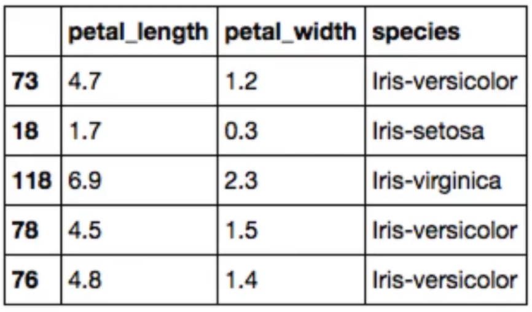
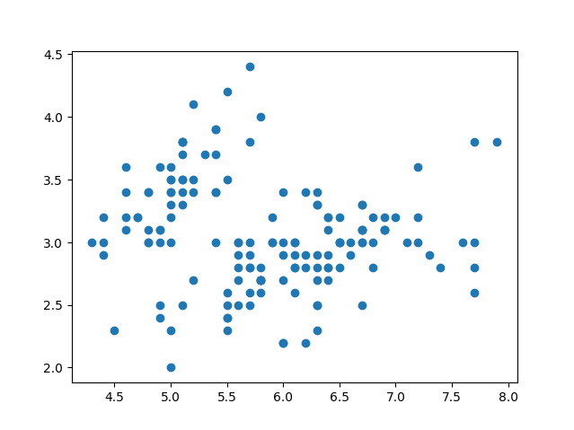
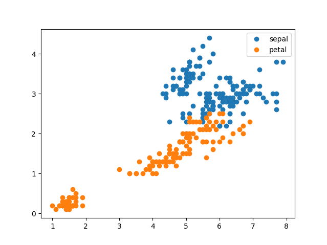
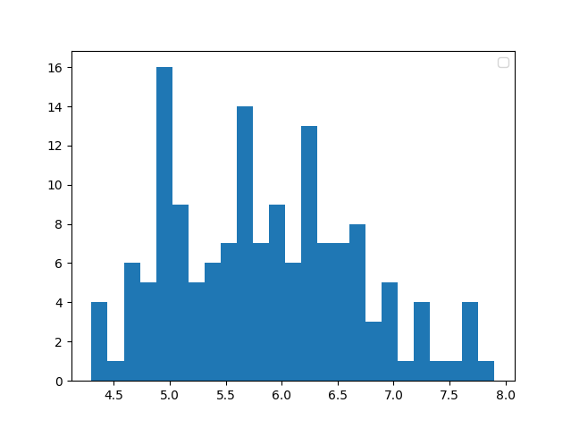
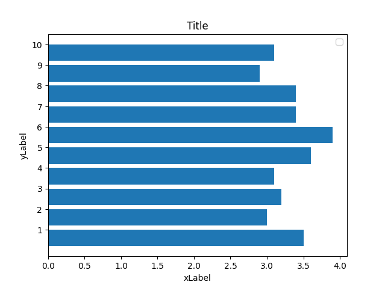
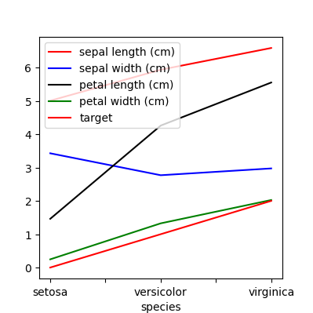
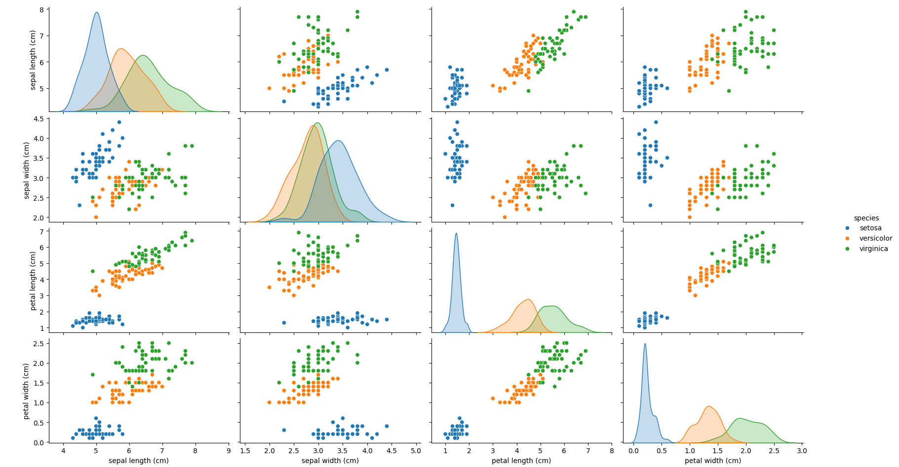
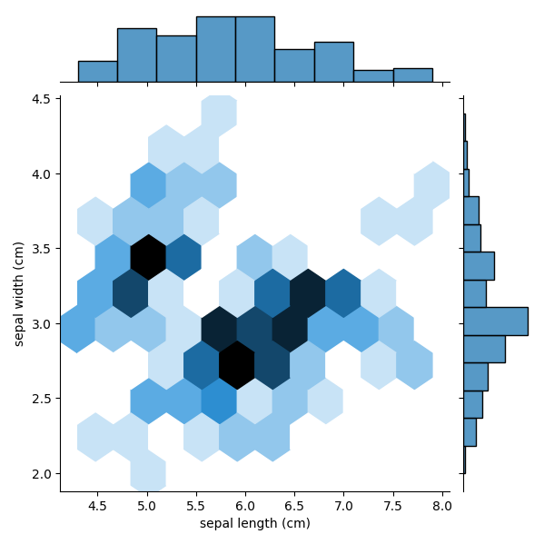
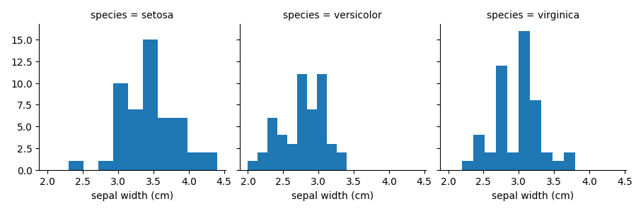
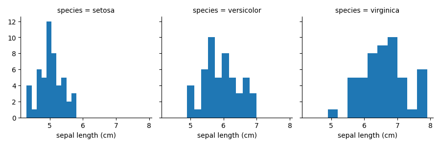

# Machine Learning Course Notes: Exploratory Data Analysis & Feature Engineering

## Section 1: Exploratory Data Analysis (EDA)

### What is EDA?
**Definition**: An approach to analyzing datasets to summarize their main characteristics, often using visual methods and statistical summaries.

**Purpose**: Think of EDA as your "initial conversation" with the data - a "getting to know you" phase with your dataset.

### Why EDA is Important
1. **Data Quality Assessment**: Determines if data makes sense as-is or needs further cleaning
2. **Pattern Identification**: Helps identify patterns and trends in the dataset
3. **Insight Generation**: Sometimes patterns discovered during EDA are as important (or more) than final modeling results
4. **Data Understanding**: Helps determine if more data is needed

### EDA Techniques

#### Statistical Summary Techniques
- **Average (Mean)**: Central tendency of data
- **Median**: Middle value, robust to outliers
- **Min/Max**: Range boundaries
- **Mode**: Most frequent values
- **Correlations**: Relationships between columns

#### Visual Techniques
- **Histograms**: Show data distribution
- **Scatter plots**: Display correlations/relationships between two columns
- **Box plots**: Visualize distribution and identify outliers

### Example: Job Applicants Analysis
**Practical application of summary statistics:**

1. **Average Scores**: 
   - Calculate average interview scores across all applicants
   - Break down by city or job function
   - Compare individual scores to group averages

2. **Mode Analysis**:
   - Find most common words in application materials
   - Identify frequently appearing qualifications

3. **Correlation Analysis**:
   - Examine relationship between technical assessment scores and years of experience
   - Break down by experience type for fair comparison
   - Identify initial relationships before modeling

### Sampling from DataFrames

**Why Sample?**
1. **Computational Efficiency**: Large datasets may take too long to process
2. **Train/Test Split**: Hold out data for model testing
3. **Representative Sampling**: Maintain proportions of outcome variables

#### Stratified Sampling
**Important Concept**: When sampling, maintain the same proportions as the original dataset.

**Example**: Disease detection dataset where only 1% have the disease
- Must ensure sample maintains 1% disease rate
- Avoid samples with 0% (missing disease cases) or overrepresentation

#### Code Example: Basic Sampling
```python
# Assuming 'data' is a pandas DataFrame
sample = data.sample(n=5, replace=False)
# n=5: take 5 random rows
# replace=False: each row appears only once (default)

# Display last 3 columns of sample
print(sample.iloc[:, -3:])
# : means all rows
# -3: means last 3 columns
```
**Output**: 

**Note from Example**:
- `.sample()` is a pandas DataFrame method
- `replace=False` prevents duplicate rows
- `.iloc[]` used for position-based selection

## Section 2: Data Visualization Libraries

### Matplotlib
**Purpose**: Main library for creating plots and graphs in Python
- **Advantages**: High flexibility, many customizable features
- **Foundation**: Base for other visualization libraries

### Pandas Plotting
**Purpose**: Convenient wrapper around matplotlib
- **Advantages**: Quick, easy plots on the fly
- **Limitations**: Less flexible than raw matplotlib
- **Use Case**: Often "good enough" for quick analysis

### Seaborn
**Purpose**: Statistical plotting library built on matplotlib
- **Advantages**: 
  - Creates aesthetically pleasing plots
  - Shorthand methods for statistical plots (linear models, correlations)
  - Would take much longer using just matplotlib
- **Note**: Once imported, Seaborn preferences apply to matplotlib plots too

### Important Setup for Jupyter Notebooks
```python
import matplotlib.pyplot as plt
%matplotlib inline  # Required for plots to show in notebook
```

## Section 3: Creating Visualizations

### Basic Scatter Plot with Matplotlib
```python
import matplotlib.pyplot as plt

plt.plot(data['sepal_length'], data['sepal_width'], 
         ls='', marker='o')
# ls='': no line style (blank)
# marker='o': circular dots
# Other markers: '^' (triangle), 'x' (x marks)
```
**Output**: 

**Note**:
- Scatter plots show relationships between two variables
- Line style must be blank for true scatter plot
- Marker style affects visual clarity

### Multi-Layer Scatter Plot
```python
# Plot sepal data
plt.plot(data['sepal_length'], data['sepal_width'], 
         ls='', marker='o', label='sepal')

# Plot petal data on same graph
plt.plot(data['petal_length'], data['petal_width'], 
         ls='', marker='o', label='petal')

plt.legend()  # Show legend with labels
```
**Output**: 


**Note**:
- Multiple `plt.plot()` calls layer on same graph
- Colors assigned automatically
- Labels enable legend for clarity

### Histogram
```python
plt.hist(data['sepal_length'], bins=25)
# bins: number of intervals for grouping data
```
**Output**: 

**Use Case**: Understanding distribution of single variable

### Advanced Customization
```python
fig, ax = plt.subplots()  # Object-oriented approach

# Create horizontal bar plot
ax.barh(np.arange(10), data['sepal_width'].iloc[:10])

# Customize ticks
ax.set_yticks(np.arange(0.4, 10.4, 1))  # Center bars
ax.set_yticklabels(range(1, 11))

# Add labels
ax.set(xlabel='X Label', ylabel='Y Label', title='Title')
```
**Output**: 

**Important Concepts**:
- `fig, ax` syntax provides more control
- `fig`: overall plot structure
- `ax`: actual plotting area
- Replace `plt.` with `ax.` in object-oriented approach

### Pandas Plotting Syntax
```python
# Group by species and calculate means
grouped = data.groupby('species').mean()

# Create line plot with customization
grouped.plot(color=['red', 'blue', 'black', 'green'],
            fontsize=10,
            figsize=(4, 4))
```
**Output**:

**Advantages**: 
- Direct plotting from DataFrame
- Automatic handling of grouped data
- Concise syntax for common operations

### Seaborn Pair Plot
```python
import seaborn as sns

sns.pairplot(data, hue='species', height=3)
# hue: color by category
# height: plot height
```
**Output**:

**What It Shows**:
- Scatter plots between all feature pairs
- Histograms on diagonal (can't plot variable against itself)
- Relationships colored by category

**Business Application**: Could show ad spend vs revenue relationships while seeing distributions of each

### Seaborn Hexbin Plot
```python
sns.jointplot(x='sepal_length', y='sepal_width', 
              data=data, kind='hex')
```
**Output**:

**Key Features**:
- Shows density of overlapping points
- Darker hexagons = more data points
- Includes marginal histograms
- Better than scatter plots for dense data

### Seaborn Facet Grid
```python
# Create grid with column for each species
g = sns.FacetGrid(data, col='species', margin_titles=True)

# Map histogram to each facet
g.map(plt.hist, 'sepal_width')

# Create second grid for different variable
g2 = sns.FacetGrid(data, col='species')
g2.map(plt.hist, 'sepal_length')
```



**Benefits**:
- Compare distributions across categories
- Consistent scales for easy comparison
- Similar to groupby but visual

## Section 4: Feature Engineering & Variable Transformation

Feature engineering is the process of creating, transforming, or selecting features (input variables) from raw data to improve the performance of a machine learning model.

### Core Concept
Models often make assumptions about data. We transform raw data to:
1. Meet model assumptions
2. Optimize model performance
3. Create linear relationships where needed

### Linear Regression Foundation
**Basic Linear Model**:
```
y = β₀ + β₁×x₁ + β₂×x₂
```

**Components**:
- y: target/outcome variable
- x₁, x₂: feature/predictor variables  
- β₀: intercept
- β₁, β₂: coefficients

**Real-World Example**: Box office returns
- x₁ = cast budget
- x₂ = marketing budget
- β₁, β₂ = how much each budget impacts revenue

### Why Transform Variables?

#### Problem: Skewed Data
- Raw data often negatively or positively skewed
- Linear regression assumes normally distributed residuals
- Transformations help achieve normal distribution

#### Solution: Data Transformations

**Log Transformation**:
```python
from numpy import log, log1p
# log1p adds 1 before log (handles zeros)
transformed = log1p(data['column'])
```

**When to Use Log Transform**:
- Positively skewed data
- Diminishing returns relationships
- Example: Larger movie budgets have diminishing returns on box office

**Result**: Transforms skewed distribution → normal distribution

### Polynomial Features
**Purpose**: Capture non-linear relationships while keeping linear model

```python
from sklearn.preprocessing import PolynomialFeatures

# Create transformer
polyFeat = PolynomialFeatures(degree=2)

# Fit to data
polyFeat.fit(X_data)

# Transform data (x becomes x and x²)
X_poly = polyFeat.transform(X_data)
```

**Note**: Still a linear model, just with transformed features (x, x², x³)

## Section 5: Variable Selection & Encoding

### Types of Variables

#### Continuous Numerical
- Raw numeric values
- Need scaling for comparison

#### Nominal (Categorical, Unordered)
- Categories without inherent order
- Examples: red/blue/green, married/single
- Need encoding to numeric

#### Ordinal (Categorical, Ordered)
- Categories with meaningful order
- Examples: low/medium/high, cold/warm/hot
- Order matters for encoding

### Encoding Techniques

#### Binary Encoding
- For two-value variables
- Convert to 0 and 1
- Examples: true/false, male/female, married/not married

#### One-Hot Encoding
**Process**:
1. Create new column for each category
2. Mark 1 if category present, 0 if not

**Example**: Color column (red, blue, green) becomes:
- is_red: [1, 0, 0]
- is_blue: [0, 1, 0] 
- is_green: [0, 0, 1]

**Code Options**:
```python
from sklearn.preprocessing import OneHotEncoder, LabelBinarizer
# or
pd.get_dummies(data['column'])  # Pandas method
```

#### Ordinal Encoding
- Convert ordered categories to integers
- Example: low→1, medium→2, high→3

**Consideration**: Assumes equal distance between categories (may not be true)

**Code Options**:
```python
from sklearn.preprocessing import OrdinalEncoder, DictVectorizer
```

## Section 6: Feature Scaling

### Why Scale Features?
**Problem**: Features often have vastly different scales
- Price: 0-10
- Number of stores: 10,000-50,000

**Impact Example: K-Nearest Neighbors Algorithm**
Imagine age measured in seconds vs years:
- Age difference (20→21 years) = 31.5 million seconds
- Surgery difference (1→10) = 9 units
- Algorithm would group by age only, ignoring surgeries!

### Scaling Methods

#### Standard Scaling (Z-score)
**Formula**: (value - mean) / standard deviation

**Properties**:
- Creates standardized units
- Centers around 0
- Affected by outliers (but less than min-max)

```python
from sklearn.preprocessing import StandardScaler
```

#### Min-Max Scaling
**Formula**: (value - min) / (max - min)

**Properties**:
- Scales all values to [0, 1]
- Heavily influenced by outliers
- Good when you need bounded range

```python
from sklearn.preprocessing import MinMaxScaler
```

**Example Calculation**:
- Min=3, Max=100, Value=40
- Scaled = (40-3)/(100-3) = 37/97 ≈ 0.38

#### Robust Scaling
**Method**: Uses interquartile range instead of min/max

**Properties**:
- Robust to outliers
- Doesn't guarantee [0, 1] range
- Better for skewed data

```python
from sklearn.preprocessing import RobustScaler
```

## Summary: Transformation Guidelines by Feature Type

### Continuous Numerical Values
- **Transformations**: Standard, Min-Max, or Robust Scaling
- **Choose based on**: Outlier presence, need for bounded range

### Nominal/Categorical (Unordered)
- **Binary variables**: Binary encoding (0/1)
- **Multiple categories**: One-hot encoding
- **Key functions**: LabelEncoder, LabelBinarizer, OneHotEncoder, pd.get_dummies()

### Ordinal (Ordered Categorical)
- **Method**: Integer encoding (1, 2, 3...)
- **Trade-off**: Preserves order but assumes equal intervals
- **Alternative**: One-hot encoding (loses ordering information)
- **Key functions**: DictVectorizer, OrdinalEncoder

## Key Takeaways

1. **EDA is Essential**: Always explore data before modeling - it's your conversation with the data

2. **Visualization Reveals Patterns**: Different plot types serve different purposes:
   - Scatter: relationships
   - Histogram: distributions
   - Box plot: outliers
   - Pair plot: all relationships at once

3. **Feature Engineering Creates Better Models**:
   - Transform to meet model assumptions
   - Create linear relationships through log/polynomial transforms
   - All features must be numeric for models

4. **Scaling Prevents Bias**: Features on different scales can dominate distance-based algorithms

5. **Choose Encoding Wisely**: 
   - Preserve information (ordering) when relevant
   - Create appropriate numeric representations
   - Consider the algorithm's assumptions

6. **Libraries Work Together**:
   - pandas: data manipulation
   - matplotlib: flexible plotting
   - seaborn: statistical visualizations
   - sklearn: transformations and scaling