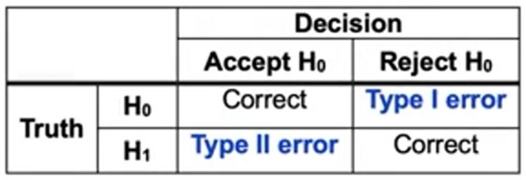

# Machine Learning: Statistical Foundations - Comprehensive Notes

## Section 1: Estimation vs. Inference in Statistics

### Core Concepts

**Estimation**: Process of determining a specific parameter value from sample data
- Example: Calculating the mean by summing all values in a column and dividing by the count
- Gives us a single point estimate (like the average)
- Formula for mean:
$$
\bar{x} = \frac{\sum_{i=1}^{n} x_i}{n}
$$
where:
* $\bar{x}$ = mean (average)
* $x_i$ = each data point
* $n$ = number of data points
* $\sum_{i=1}^{n} x_i$ = sum of all data points

👉 In words: *Add up all the values, then divide by how many values there are.*

Would you like me to also show you the formula for **weighted mean** (when some values have more importance than others)?

**Statistical Inference**: Understanding the entire underlying population distribution
- Goes beyond just point estimates
- Includes parameters like standard error
- Standard error formula: measures average distance of values from the mean estimate
- Helps understand the reliability and spread of our estimates

### Connection to Machine Learning

Both ML and statistical inference:
- Use sample data to infer qualities about the actual population
- Try to understand the data-generating process
- Model the relationship between variables (e.g., linear model represents joint distribution between x and y)

Note:
- Some ML models focus heavily on understanding individual parameter effects (requires statistical inference tools)
- Other ML models focus primarily on prediction results (just the estimates)

### Business Example: Customer Churn

**Churn**: When a customer leaves the company (undesirable outcome)

**Data Components**:
- Target variable: Whether customer left (0 = stayed, 1 = left)
- Features for prediction:
  - Length of customer relationship
  - Type and amount of purchases
  - Customer characteristics (age, location)
  - Churn probability score (0.01 = likely to stay, 0.99 = likely to leave)

**Estimation Application**:
- "For every additional year as a customer, they are 20% less likely to churn"
- This gives a single estimate value

**Inference Application**:
- "95% confidence interval: effect is between 19% and 21%"
- This tells us how certain we are about our estimate
- Wide interval (e.g., -10% to 50%) = high uncertainty
- Narrow interval (e.g., 19% to 21%) = high confidence

### Exploratory Data Analysis (EDA) Examples

**Dataset**: Telco customer churn from IBM Cognos Analytics
- Contains: account type, customer characteristics, revenue per customer, satisfaction scores, customer lifetime value (CLV)

**Key Visualizations**:
1. **Bar Plot** (Payment type vs. Churn):
   - Finding: Credit card users less likely to churn than bank withdrawal or mailed check users
   - Used `pd.DataFrame` stored in `df_phone`

2. **Bar Plot** (Tenure vs. Churn):
   - Used `pd.cut()` to create 5 categorical bins from continuous months data
   - Finding: Shorter tenure customers much more likely to churn
   - Bins: 0-15 months, 15-30 months, etc.

3. **Pair Plot**:
   - Variables examined: months as customer, GB usage/month, total revenue, CLV, churn value
   - Split by churn status (hue=churn_value)
   - Blue = didn't churn (0), Green = churned (1)
   - Shows relationships between all variable pairs

4. **Hexbin Plot** (Joint plot):
   - X-axis: Tenure in months
   - Y-axis: Monthly charge
   - Finding: High density at extremes (new customers with high charges, long-term customers with high charges)
   - Low density in middle ranges

## Section 2: Parametric vs. Non-parametric Statistics

### Parametric Models

**Definition**: Statistical models constrained to finite number of parameters with strict distributional assumptions

**Characteristics**:
- Fixed number of parameters (e.g., mean μ and standard deviation σ for normal distribution)
- Assumes data comes from specific distribution
- Example: Linear regression (OLS) - predefined coefficients for features
- Generally faster to solve but more constrained

**Normal Distribution Parameters**:
- Mean (μ): Center of distribution
- Standard deviation (σ): Spread of distribution
- These two parameters completely define the distribution shape

### Non-parametric Models

**Definition**: Distribution-free inference without strict assumptions

**Characteristics**:
- No assumption about underlying distribution
- Uses actual data to define distribution
- Example: Creating histogram from data to estimate CDF (Cumulative Distribution Function)
- More flexible but requires more data

### Business Application: Customer Lifetime Value

**CLV Components**:
- Expected customer duration
- Expected spending over time

**Modeling Approaches**:
1. **Parametric**: Assume specific distribution (e.g., linear spending over time)
2. **Non-parametric**: Rely heavily on actual data patterns

### Maximum Likelihood Estimation (MLE)

**Concept**: Find parameter values that maximize the likelihood of observing our sample data

**Process**:
1. Define likelihood function (function of parameters)
2. For normal distribution: parameters are μ and σ
3. Choose values that maximize likelihood given observed data
4. Answers: "What are the most likely population parameters given our sample?"

## Section 3: Common Statistical Distributions

### 1. Uniform Distribution
- **Shape**: Flat, equal probability for all values in range
- **Real-world example**: Rolling a die (1-6 equally likely)
- **Key feature**: Every outcome has identical probability

### 2. Normal (Gaussian) Distribution
- **Shape**: Bell curve, symmetric around mean
- **Parameters**: 
  - Mean (μ): determines center location
  - Standard deviation (σ): determines spread (smaller σ = tighter, pointier curve)
- **Central Limit Theorem**: Averages of many samples form normal distribution
- **Real-world example**: Human height (most near average, few at extremes)

### 3. Log-normal Distribution
- **Shape**: Right-skewed with long tail
- **Property**: Taking log transforms it to normal distribution
- **Smaller σ**: Closer to normal appearance
- **Real-world example**: Household income (most around median ~$60k, long tail to billionaires)

### 4. Exponential Distribution
- **Shape**: Most values near zero, decreasing probability
- **Use case**: Time between events
- **Real-world example**: Time between video views (usually short intervals, occasionally long gaps)

### 5. Poisson Distribution
- **Use case**: Number of events in fixed time period
- **Parameter**: Lambda (λ) = both mean and variance
- **Real-world example**: 
  - λ=1: Usually 1 person watches video per 10 minutes (tight distribution)
  - λ=10: Average 10 viewers per 10 minutes (more spread, could be 5-15)

## Section 4: Frequentist vs. Bayesian Statistics

### Frequentist Approach

**Core Philosophy**: Concerned with repeated observations to the limit

**Key Principles**:
- Start with no prior knowledge of probabilities
- Fixed true population parameter exists
- Derive estimates directly from data only
- Confidence based on sample size coverage

**Example - Queuing Theory**:
- Problem: How many servers needed for customer queue?
- Applications: Cashiers, web servers, customer service reps
- Need to estimate customer arrival probabilities (Poisson distribution)
- More data → stronger estimates

### Bayesian Approach

**Core Philosophy**: Parameters themselves have probability distributions

**Key Principles**:
- Incorporates prior beliefs/knowledge
- Updates beliefs with observed data
- Parameters have probability distributions (not fixed values)
- Results in posterior distribution

**Bayesian Process**:
1. **Prior Distribution**: Initial belief about parameter
2. **Observe Data**: Collect sample information
3. **Update**: Combine prior with data
4. **Posterior Distribution**: Updated belief after seeing data

**Example - Customer Queue**:
- Can start with educated guess (prior)
- Update estimate as more data arrives
- Tighter distribution with more data

## Section 5: Hypothesis Testing Fundamentals

### Basic Concepts

**Hypothesis**: Statement about population parameter

**Two Hypotheses**:
1. **Null Hypothesis (H₀)**: Default assumption, often "no effect"
2. **Alternative Hypothesis (H₁)**: What we're testing for

**Decision Process**: Use sample data to accept or reject null hypothesis

### Bayesian Hypothesis Testing

Instead of hard decision boundary:
- Calculate posterior probabilities for both hypotheses
- Compare which is more likely
- No binary accept/reject, but probability statements

### Coin Toss Example

**Setup**:
- Coin 1: 50% heads (fair)
- Coin 2: 70% heads (biased)
- Task: Flip unknown coin 10 times, determine which it is

**Results Analysis**:
- 3 heads observed
- P(3 heads | fair coin) = 0.117
- P(3 heads | biased coin) = 0.009
- **Likelihood Ratio**: 0.117/0.009 = 13
- Conclusion: Fair coin is 13 times more likely

### Bayesian Framework with Priors

**Prior Probabilities**:
- If randomly selected: P(fair) = P(biased) = 0.5
- If from general population: P(fair) might be 0.99

**Bayes Rule Application**:
P(H₁|data) = P(data|H₁) × P(H₁) / P(data)

**Impact of Priors**:
- Equal priors (0.5/0.5): Likelihood ratio dominates
- Unequal priors (0.99/0.01): Need stronger evidence to overcome prior belief

**Note**:
- Frequentist: set a threshold (e.g. α = 0.05) and decide whether to reject H₀.

- Bayesian: calculate posterior probabilities for H₀ and H₁, compare probabilities to choose the more reasonable hypothesis.

- The coin example illustrates clearly: Bayesian shows us “Fair coin is 13 times more likely” instead of just saying “do not reject H₀”.

## Section 6: Type I and Type II Errors

### Error Types

**Type I Error**: Incorrectly rejecting true null hypothesis
- Example: Conclude coin is biased when it's actually fair
- Controlled by significance level (α)

**Type II Error**: Incorrectly accepting false null hypothesis
- Example: Conclude coin is fair when it's actually biased
- Related to test power

**Power of Test**: 1 - P(Type II Error)
- Probability of correctly rejecting false null
- Trade-off with Type I error rate

### Business Example: Customer Churn Prediction

**Hypotheses**:
- H₀: Churn is random (no effect of tenure)
- H₁: Customers >2 years less likely to churn

**Error Implications**:
- **Type I Error**: Conclude tenure matters when it doesn't
  - Waste resources on retention programs for long-term customers
- **Type II Error**: Miss real tenure effect
  - Fail to implement effective retention strategies

### Hypothesis Testing Terminology

1. **Test Statistic**: Calculated value from sample data for decision-making
2. **Rejection Region**: Values where we reject null
3. **Acceptance Region**: Values where we accept null
4. **Null Distribution**: Distribution of test statistic under null hypothesis

### Business Applications

1. **Marketing Campaign**:
   - H₀: Campaign has no effect on purchases
   - H₁: Campaign increases purchases

2. **Website Layout**:
   - H₀: Layout change has no impact on traffic
   - H₁: Layout change affects traffic

3. **Product Quality**:
   - H₀: Product size meets standard S
   - H₁: Significant deviation from standard S

## Section 7: Significance Levels and P-values

### Significance Level (α)

**Definition**: Probability threshold for rejecting null hypothesis

**Key Points**:
- Must be chosen BEFORE analyzing data
- Common values: 0.10, 0.05, 0.01, 0.001
- Lower α = more conservative (avoid Type I errors)

**Selection Guidelines**:
- High-stakes (medicine): α = 0.001 or lower
- Low-stakes (font size): α = 0.10 acceptable

### P-value

**Definition**: Probability of observing results as or more extreme than actual, assuming null is true

**Interpretation**:
- Small p-value = strong evidence against null
- P-value < α = reject null
- Represents smallest significance level for rejection

### Visual Understanding

**Normal Distribution Example** (α = 0.05):
- Rejection region: Beyond ±2 standard deviations
- 95% of values fall within ±2σ
- 5% in tails (rejection region)

### Coin Toss Example Continued

**Test Setup**:
- H₀: Fair coin (p = 0.5)
- H₁: Biased toward tails (p < 0.5)
- Observed: 3 heads in 10 flips
- α = 0.05

**Calculation**:
- P(≤3 heads | fair coin) = 0.171
- Since 0.171 > 0.05, fail to reject null
- Conclusion: Insufficient evidence of bias

### F-Statistic in Regression

**Purpose**: Test if features improve prediction over just using mean

**Null Hypothesis**: All β coefficients = 0 (features don't help)

**Interpretation**:
- Large F-statistic = features likely helpful
- Small p-value = reject null (features matter)

### Multiple Testing Problem

**Issue**: More tests increase chance of Type I error

**Probability of at least one Type I error**:
- Formula: 1 - (1 - α)^(number of tests)
- Approximation: α × (number of tests) for ≤10 tests
- Example: 10 tests at α=0.05 → ~50% chance of error

### Bonferroni Correction

**Purpose**: Control overall Type I error rate

**Method**: 
- Adjusted α = Original α / Number of tests
- Example: 10 tests, want overall 0.05 → use 0.005 per test

**Trade-offs**:
- Reduces Type I errors
- Decreases power (harder to detect real effects)
- Effects need to be larger or samples bigger

**Best Practice**: Limit tests to well-motivated hypotheses

## Section 8: Correlation vs. Causation

### Fundamental Distinction

**Correlation**: Statistical relationship between variables
- Useful for prediction
- X helps predict Y

**Causation**: Direct cause-and-effect relationship
- Can manipulate X to change Y
- Requires understanding mechanism

### Weather Example: Rain and Temperature

**Observation**: Rain associated with cool weather

**Possible Mechanisms**:
1. Warm → more evaporation → more rain
2. Cool → lower dew point → rain when humid air cools

**Lesson**: Must understand mechanism for causal claims

### Why Variables Can Be Correlated

1. **X causes Y**: Marketing budget → increased revenue
2. **Y causes X**: Higher revenue → bigger marketing budget
3. **Common cause (Confounding)**: Holiday season → both increase
4. **Spurious**: Random coincidence in sample

### Important Examples

**Test Scores and Study Time**:
- Correlation: More study → better scores
- Wrong conclusion: Give better grades to increase studying
- Reality: Studying causes better performance

**Customer Service Calls**:
- Correlation: More calls → lower satisfaction
- Wrong conclusion: Hide phone numbers
- Reality: Low satisfaction causes more calls

### Confounding Variables

**Definition**: External variable causing both X and Y to change

**Examples**:

1. **Car Accidents & People Named John**:
   - Both increase with population size
   - No causal relationship

2. **Ice Cream Sales & Drownings**:
   - Both increase with temperature
   - Temperature is confounding variable
   - Predictive power exists but no causation

3. **Factories & Chip Sales**:
   - Both driven by market demand
   - Building factories won't increase sales without demand

### Spurious Correlations

**Definition**: Coincidental correlations without real relationship

**Examples**:
- Miss America age vs. murders by steam (r = 0.87!)
- Space launches vs. sociology PhDs

**Common with time series**: Things trending similarly over time may appear correlated

### Note

1. **Correlation ≠ Causation**: Never assume changing X will change Y just because they're correlated

2. **Predictive Power**: Correlations can still be useful for prediction even without causation

3. **Danger Zone**: Using correlations to make interventions without understanding causation

4. **Always Consider**:
   - What's the mechanism?
   - Could there be confounding variables?
   - Is this just coincidence?

5. **Business Implications**: Before making recommendations based on correlations, always investigate potential confounding variables and true causal mechanisms